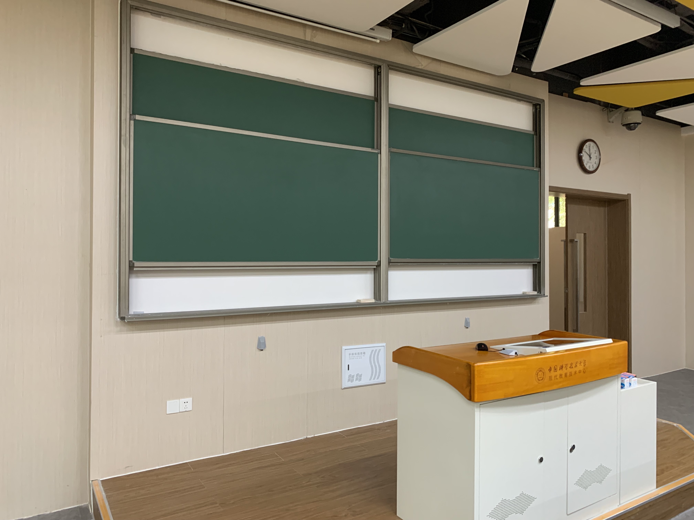

# 三教奇妙夜

~~据说这是一道会让人做噩梦的题目。~~

本题的灵感源于之前有几次网上看视频的时候，注意到有一些一闪而过的画面。之前几次我都是下载下来，播放器跳到大概的位置，然后一帧一帧看有没有不正常的地方。但能不能用程序来做这个事情呢？

这里为了简化和下载方便，只弄了一张图片（3C 教学楼实拍），里面混入了一些 flag 片段的图片。题目描述也很明显告诉了各位：

> 而且视频时不时会闪过**黑底白字**的神秘内容。

我还特地把「黑底白字」加粗了。

理论上讲，如果你聚精会神看 12 个小时，是能拿到 flag 的，但是不会有哪个正常人这么做。所以我们需要编程来解决这个问题。

## OpenCV 解法

OpenCV 是一个计算机视觉库。我们这里使用 OpenCV 的 Python 接口。其实只需要知道这么几个 API 就可以了：

- `file = cv2.VideoCapture(filename)`: 打开一个视频文件。
- `file.read() -> ret, frame`: 读取这个视频文件的一帧，返回状态与对应的帧。
- `cv2.absdiff(frame1, frame2)`: 比较两个帧，返回一个 Array。
- `array.sum()`: 求 Array 的和。

此外为了显示图片，可以使用 `matplotlib`，`from matplotlib import pyplot as plt` 然后 `plt.imshow(frame)` 和 `plt.show()` 就行。完整的代码如下，可以在 Jupyter Notebook 中运行。

```python
import cv2
from matplotlib import pyplot as plt

file = cv2.VideoCapture("output-1.mp4")
ret, preframe = file.read()

while True:
  ret, frame = file.read()
  if ret == 0:
    break
  diff = cv2.absdiff(preframe, frame).sum()
  if diff > 10000:
    print("diff: {}".format(diff))
    plt.imshow(frame)
    plt.show()
  preframe = frame
```

跑起来之后休息一会，flag 图片就全部出来了。

## FFmpeg?

你可能会尝试用 https://superuser.com/questions/669716/how-to-extract-all-key-frames-from-a-video-clip 的办法:

```
ffmpeg -skip_frame nokey -i output.mp4 -vsync 0 -r 30 -f image2 thumbnails-%02d.jpeg
```

提取视频中的关键帧，但不管怎么找，都会发现少一两张 flag 图片。这可能是因为编码器在编码的时候没有把所有的 flag 图片设置为关键帧导致的。

把所有的帧提取成图片可以吗？理论上是可以的，但是对很多人来说，这样做产生的图片总大小都是无法接受的。我自己硬盘空间也不够，所以也没有试这种解法。

我也很好奇是否有只用 `ffmpeg` 完成本题的做法，有的话欢迎投稿你的 wp（

**2019-10-22 19:45 Update**: 一开始试过用 `ffmpeg` 去掉重复帧，但是看到输出里面 `speed` 和 `fps` 都很慢，误以为需要花费远大于视频总时间的时间来处理，所以当成不可行了。现在我又试了几个用 `ffmpeg` 处理的方法，都是可以在可接受时间内获得结果的。

现在几个使用 `ffmpeg` 完成此题的详细的讨论/题解可以参见：

- https://github.com/ustclug/hackergame2019-writeups/issues/2
- https://github.com/ustclug/hackergame2019-writeups/issues/19
- [https://github.com/ustclug/hackergame2019-writeups/blob/master/players/sparkcyf/writeup-%E4%B8%89%E6%95%99%E5%A5%87%E5%A6%99%E5%A4%9C.md](https://github.com/ustclug/hackergame2019-writeups/blob/master/players/sparkcyf/writeup-三教奇妙夜.md)
- https://www.nottres.com/nonetype/ustc-hackergame-2019-writeup.html
- https://github.com/ustclug/hackergame2019-writeups/tree/master/players/xukl
- [https://github.com/ustclug/hackergame2019-writeups/blob/master/players/stevapple/%E4%B8%89%E6%95%99%E5%A5%87%E5%A6%99%E5%A4%9C/README.md](https://github.com/ustclug/hackergame2019-writeups/blob/master/players/stevapple/三教奇妙夜/README.md)

## 花絮

我一开始想用非线编软件来出这道题的，但是对于一个 ~12h 的视频项目来说，编辑和导出都是一种折磨，最后一次尝试导出的时候还把我的电脑搞到 kernel panic 了，于是转 `ffmpeg` 了。

这里用的是 ffmpeg 的 concat demuxer 来做的，导出为 H264 的视频，没有调视频参数（因为我自己也不精通）。在出这道题的时候，我自己也了解了很多视频编码相关的知识。

另外附上这间教室（3C102）的原图：

