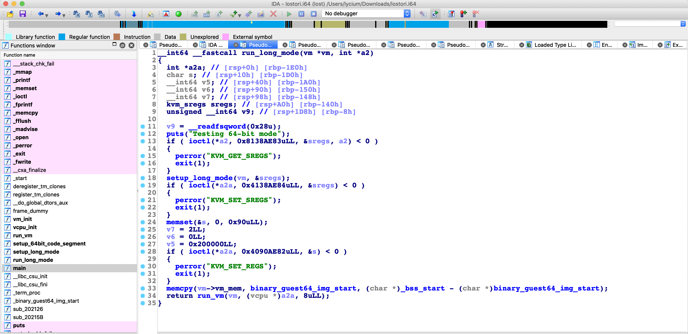
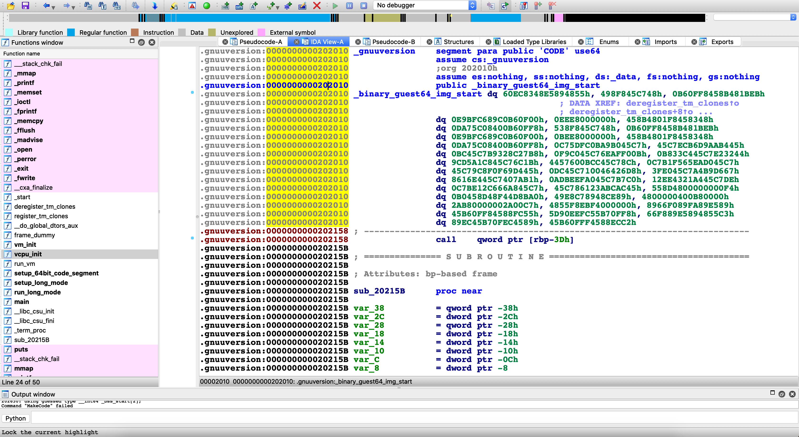
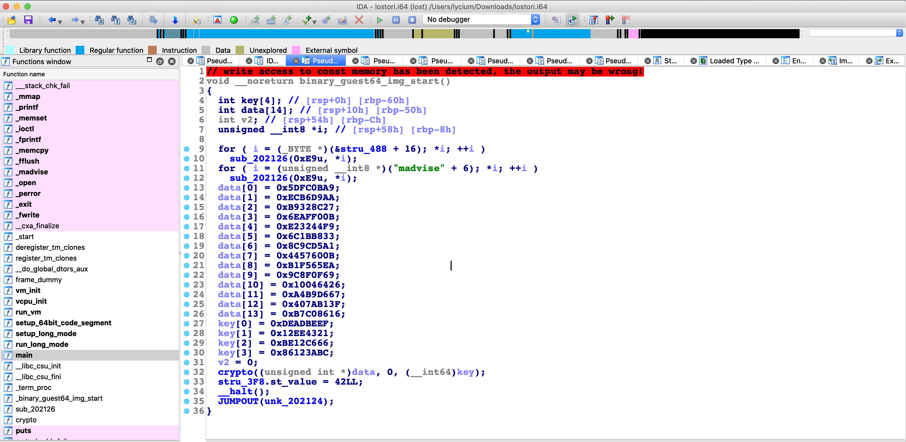
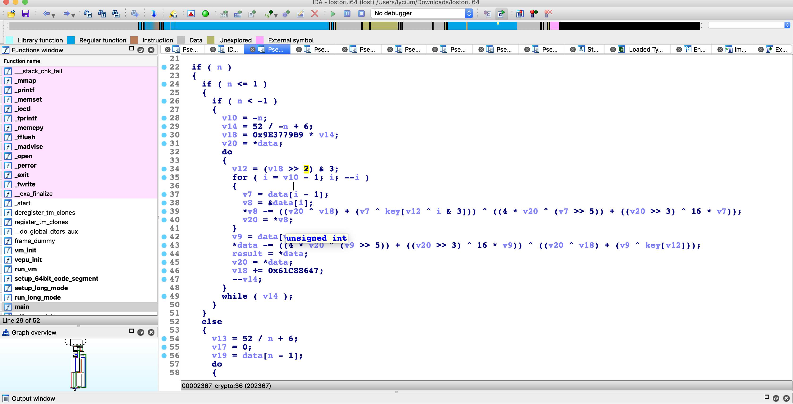

# 失落的圣物

- 题目分类：binary

- 题目分值：300

今年对于蜗壳魔法学院来讲是不平凡的一年。物理教授们在今年 4 月 1 号发表了《印象魔法人》命运的结论：一教地下具有大储量的金矿。

原来，在一教测得的魔法加速度总是和其他区域测得的魔法加速度差值过大，对于这一魔法现象，仔细的校对实验报告和研究不同区域加速度值，大量的计算后证实了一教楼底确实存在大量的金属——金。

这一消息的公布，让学生们热血沸腾，各个院系的学生们各展神通。火焰魔法系的同学们通过爆炸魔法对一教底座进行了矿洞打孔，同学通过测量爆破产生的声波数据精准的定位到了金矿位置。之后便展开了挖掘工作。

但是找到的并非让人神往的金矿。同学们只发现了一个圣杯。在重见阳光后，圣杯反射着诡异的光。其中又有什么不为人知的秘密呢？

[打开/下载题目](src/lost)

---

花絮：这是一个十分 mini 的虚拟机，起源很简单，出题人被 XNUCA 的 KVM 伤害过，所以准备出一个虚拟机，一个真的虚拟机而不是 VMP 保护的虚拟机。

KVM 是 Linux 文件抽象化 Kernel-based Virtual Machine 后的文件。KVM 总的来说是虚拟机软件运行的一个比较重要的基石。使得我们操作 Intel VT or AMD-V 来创建和使用虚拟设备更加轻便。

为了赶的上时代潮流，所以全部题目都是 64 bit 的，那我也用 KVM 创建一个 64 位的虚拟机。


那么启动一个虚拟机就三步就可以完成。`vm` 相关属性初始化，虚拟 CPU 相关属性初始化，之后初始化 CPU 使 CPU 在 long mode 下运行。前两个函数都在进行相关初始化的工作。都是约定俗成的调用约定，相关详细细节可以查询 KVM 相关资料即可了解。主要的逻辑在第三个函数 `run_long_mode()`。



我们可以看到虚拟机执行代码段的内容就是 `binary_guest64_img_start`



我们看到了一堆数据一样的东西。我们把鼠标移动到地址为 `0x202010` 的位置按 “C” 键，把这段数据创建成函数。然后按 F5。


看到这里，我想大概率的我们知道这些数据是什么了，这些数据就是 flag 加密后的内容。

改一下类型让 F5 的结果好看一些。



我们来着重分析下 `crypto()` 函数。

如此规整的反编译结果一定是某种加密算法。



这样结构的加密算法是 XXTEA 加密。可以看到当 n > 0 时是加密，n < 0 时是解密算法，n 是 int 长度。

```C
#include <stdio.h>
#include <stdlib.h>
#include <stdint.h>

#define DELTA 0x9e3779b9
#define MX (((z >> 5 ^ y << 2) + (y >> 3 ^ z << 4)) ^ ((sum ^ y) + (key[(p & 3) ^ e] ^ z)))

void btea(uint32_t *v, int n, uint32_t const key[4])
{
  uint32_t y, z, sum;
  unsigned p, rounds, e;
  if (n > 1)
  { /* Coding Part */
    rounds = 6 + 52 / n;
    sum = 0;
    z = v[n - 1];
    do
    {
      sum += DELTA;
      e = (sum >> 2) & 3;
      for (p = 0; p < n - 1; p++)
      {
        y = v[p + 1];
        z = v[p] += MX;
      }
      y = v[0];
      z = v[n - 1] += MX;
    } while (--rounds);
  }
  else if (n < -1)
  { /* Decoding Part */
    n = -n;
    rounds = 6 + 52 / n;
    sum = rounds * DELTA;
    y = v[0];
    do
    {
      e = (sum >> 2) & 3;
      for (p = n - 1; p > 0; p--)
      {
        z = v[p - 1];
        y = v[p] -= MX;
      }
      z = v[n - 1];
      y = v[0] -= MX;
      sum -= DELTA;
    } while (--rounds);
  }
}

uint32_t cipher[4];

int main()
{
  uint32_t v0[18]={0};
    v0[4] = 0x5DFC0BA9;
  v0[5] = 0xECB6D9AA;
  v0[6] = 0xB9328C27;
  v0[7] = 0x6EAFF00B;
  v0[8] = 0xE23244F9;
  v0[9] = 0x6C1BB833;
  v0[10] = 0x8C9CD5A1;
  v0[11] = 0x4457600B;
  v0[12] = 0xB1F565EA;
  v0[13] = 0x9C8F0F69;
  v0[14] = 0x10046426;
  v0[15] = 0xA4B9D667;
  v0[16] = 0x407AB13F;
  v0[17] = 0xB7C08616;
  v0[0] = 0xDEADBEEF;
  v0[1] = 0x12EE4321;
  v0[2] = 0xBE12C666;
  v0[3] = 0x86123ABC;
  
  btea(&v0[4], -14, v0);
  printf("%s", &v0[4]);
  return 0;
}

```

bingo！
