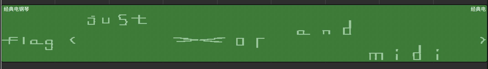

# 小 U 的加密

我承认，这是本次比赛中，我出的需要脑洞最大的题目，并且有可能这道题给人的体验确实不是很好……

## 是什么加密呢？

> 最近，他刚学了位运算，就写了个小程序来「加密」自己的文件。

`file` 和 `strings` 都是没有结果的。

```
$ file flag.enc
flag.enc: data
$ strings flag.enc | grep flag
$
```

但如果把 `flag.enc` 往十六进制编辑器里面拖的话，可以看到一堆重复的 `999999`，加上萌新 + 位运算的提示（再加上一点脑洞），可以猜到是异或加密，而且 key 是只有一个字节的那种。

## 是什么文件呢？

我们选择最暴力的方法解决问题：把所有可能的 key 全部试一遍。

```
fin = open("flag.enc", "rb")
fin_data = fin.read()

for i in range(1, 0xff + 1):
    fout = open("flag.{}".format(i), "wb")
    data = bytearray(fin_data)
    for j, item in enumerate(data):
        data[j] = item ^ i
    fout.write(data)
    fout.close()
```

执行完之后 `file flag.*`。这里列出了一些看起来有东西的结果：

```
flag.108: PDP-11 overlaid pure executable not stripped
flag.110: ARC archive data, packed
flag.198: AIX core file fulldump 32-bit,（后面是一堆乱码）
flag.204: COM executable for DOS
flag.225: PGP	Secret Key -
flag.227: PGP	Secret Sub-key -
flag.248: DOS executable (COM, 0x8C-variant)
flag.56:  unicos (cray) executable
flag.57:  Standard MIDI data (format 0) using 1 track at 1/480
```

> 我们拿到了一份经过他加密之后的文件（据称这是一个音频文件）

所以我们有理由相信，目标文件是 `flag.57`，找个 MIDI 播放器播放，看起来是可以播放的。

```
$ timidity flag.57.midi
（省略部分输出）
Format: 0  Tracks: 1  Divisions: 480
Sequence: 经典电钢琴
Instrument: 施坦威大钢琴
（省略部分输出）
Playing time: ~21 seconds
Notes cut: 0
Notes lost totally: 0
```

显然，这是我们需要的文件。

## flag 在哪里呢？

直接听只能听到嘈杂的钢琴声，是听不出什么东西的。这里，需要将 MIDI 的音符找个软件来可视化（脑洞 * 2）。当然，这是绝大多数 MIDI 的编辑器都可以做到的。最终效果如下：



## 花絮

这道题的灵感一部分来源于今年年初时候玩的某个游戏，它的 BGM 就是用几乎一致的方法进行「加密」的（当然格式不是 MIDI 是 OGG）。本题解密要难一些，因为 OGG 的文件头特征（`OggS`）就算没有了解过，也能猜出来是这个格式，猜都能猜到，但 MIDI 就不一样了（`MThd`）。