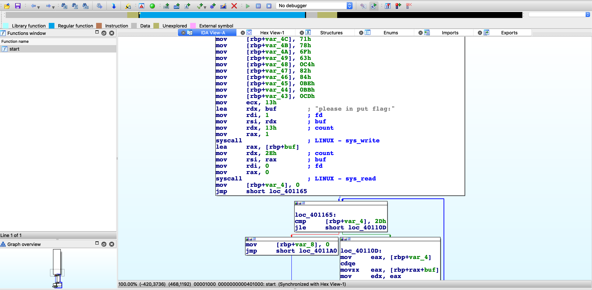

# 小巧玲珑的 ELF

- 题目分类：binary

- 题目分值：150

HR 问眼前的年轻人：“你说你会编程？”

年轻人回答道：“是的，我会用 C 编程。”

HR 很是不屑的看着年轻人问：“C 语言是基础，很多人都会 C 语言，我来考考你，你来说一说你常用的 C 语言头文件。”

年轻人：“`stdio`，`stdlib`，`stdint`等等，这些我都很熟悉的，这些库里面的函数我也用的很 6。”

HR笑着问年轻人：“哼哼哼，用库函数看不出水平，你能不用系统库函数实现功能吗？”

年轻人心中一惊，不用库函数怎么编程？年轻人正想着，HR 给了他一个文件对他说：“把它研究明白，再来找我吧！”

[打开/下载题目](src/tinyELF)

---

花絮：出题人想了很久，逆向怎么好玩，还要让萌新友好呢？在此过程中一位同学喜欢开源套件的工具 `objdump`，那就出一个逆向很友好的题目吧，有反汇编引擎做起来会十分的舒服。这个同学参加玩比赛之后就抛弃了 `objdump`，2333333。笑死

新手友好！新手友好！

那么当然不要搞那么多花里胡哨的东西咯，所以我出题的时候就没有使用任何库函数，只使用了 `syscall`，使用一些技巧处理编译后就剩下了一个孤零零的 `start` 函数。

一般而言，ELF 的入口函数是 `start` 函数。



在动员大会上我介绍了 IDA 的牛逼功能 F5，按一下玩一年。


可以看到 `v0`-`v45` 总共 46 个 char 型变量。我们先创建一个 46 字节的数组。


逻辑很清晰了，读取一个字符串到 `input` 数组里。然后对该数组的每一个先加 2i，再与 i 异或，再减去 i。

然后和 `aim` 数组中的数值比较。写一个 Python 逆运算脚本即可。

```python
#!/usr/bin/env python3
aim = [102,110,101,107,131,78,109,116,133,122,111,87,145,115,144,79,141,127,99,54,108,110,135,105,163,111,88,115,102,86,147,159,105,112,56,118,113,120,111,99,196,130,132,190,187,205]
for i in range(len(aim)):
    one = aim[i]
    one = (one + i) % 256
    one = one ^ i
    one = (one - 2 * i) % 256
    print(chr(one), end="")
```

## zzh 的解法

先看一下程序里面的可见字符串

```
$ strings tinyELF
please in put flag:
correct
```

看起来输入正确的 flag 后会打印 `correct`。

用 angr 求解什么样的输入可以使得程序输出 `correct`：

```python
import angr

proj = angr.Project("tinyELF")
simgr = proj.factory.simgr()
simgr.explore(find=lambda s: b"correct" in s.posix.dumps(1))
print(simgr.found[0].posix.dumps(0))
```

运行一下，得到 flag：

```
$ python3 solve.py
b'flag{Linux_Syst3m_C4ll_is_4_f4scin4ting_t00ls}'
```
## 出题人对 zzh 解法的评价
路子够正宗，自动化分析万岁！
