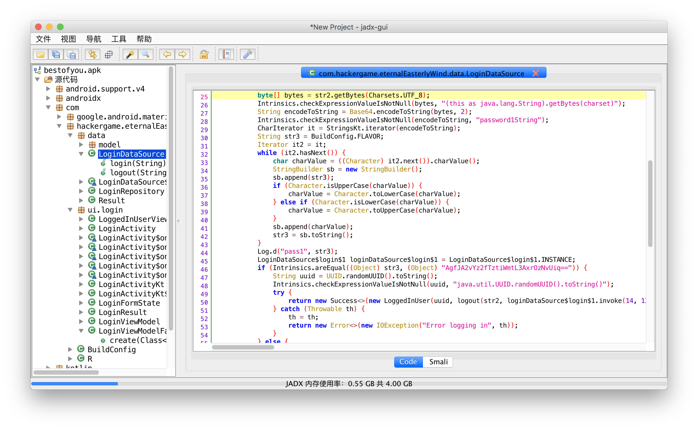

# 献给最好的你

如果按照标准 CTF 的分类，这是一道简单的 Mobile 题。（事实上，解密的难度比上个月那个传播的 APK 要低得多，毕竟你不用打开 IDA 去看 Lua 的动态链接库的逻辑。）

## 题解

如果你在模拟器或者真机上运行过，你会发现它只是播放音乐，输入正确的密码就搞定的一个小 App，没有什么破坏性（毕竟什么权限都没要），~~也不会让你社会性死亡~~（当然如果你就是要手机音量开最大然后上课的时候开了出来的话我也没办法）。

选择你最喜欢的处理 APK 的工具（我这里用 jadx），反编译题目的 APK 包。

进入 `com.hackergame.eternalEasterlyWind`，开始看里面的代码。`BuildConfig` 和 `R`（资源类）可以先忽略掉。接下来主要就是两个部分：`data` 和 `ui.login`。

翻找一通后可以发现，`data.LoginDataSource` 里面有点东西。



```java
public final Result<LoggedInUser> login(String str) {
        String str2 = str;
        Intrinsics.checkParameterIsNotNull(str2, "password");
        try {
            byte[] bytes = str2.getBytes(Charsets.UTF_8);
            Intrinsics.checkExpressionValueIsNotNull(bytes, "(this as java.lang.String).getBytes(charset)");
            String encodeToString = Base64.encodeToString(bytes, 2);
            Intrinsics.checkExpressionValueIsNotNull(encodeToString, "password1String");
            CharIterator it = StringsKt.iterator(encodeToString);
            String str3 = BuildConfig.FLAVOR;
            Iterator it2 = it;
            while (it2.hasNext()) {
                char charValue = ((Character) it2.next()).charValue();
                StringBuilder sb = new StringBuilder();
                sb.append(str3);
                if (Character.isUpperCase(charValue)) {
                    charValue = Character.toLowerCase(charValue);
                } else if (Character.isLowerCase(charValue)) {
                    charValue = Character.toUpperCase(charValue);
                }
                sb.append(charValue);
                str3 = sb.toString();
            }
            Log.d("pass1", str3);
            LoginDataSource$login$1 loginDataSource$login$1 = LoginDataSource$login$1.INSTANCE;
            if (Intrinsics.areEqual((Object) str3, (Object) "AgfJA2vYz2fTztiWmtL3AxrOzNvUiq==")) {
                String uuid = UUID.randomUUID().toString();
                Intrinsics.checkExpressionValueIsNotNull(uuid, "java.util.UUID.randomUUID().toString()");
                try {
                    return new Success<>(new LoggedInUser(uuid, logout(str2, loginDataSource$login$1.invoke(14, 13, 2, 12, 30, 30, 2, 0, 31, 11, 109, 81, 83, 8, 3, 54, 21, 6, 2, 39, 33, 104, 44, 62, 17, 14, 19, 23, 21, 18, 8, 24))));
                } catch (Throwable th) {
                    th = th;
                    return new Error<>(new IOException("Error logging in", th));
                }
            } else {
                throw new Exception("错误的密码。");
            }
        } catch (Throwable th2) {
            th = th2;
            return new Error<>(new IOException("Error logging in", th));
        }
}
```

`str` 是界面中输入的字符串，然后 base64 编码，再大小写互换之后，与 `"AgfJA2vYz2fTztiWmtL3AxrOzNvUiq=="` 对比，如果一致，则继续。

```python
s = "".join([i.lower() if i.isupper() else i.upper() for i in "AgfJA2vYz2fTztiWmtL3AxrOzNvUiq=="])

import base64
print(base64.b64decode(s))
```

结果是 `hackergame2019withfun!`，但这是界面上输入的密码，还不是最终的 flag。有两种做法：

- 动态运行，把它输入进去，就能拿到 flag 了。
- 继续静态分析。

继续看代码可以看到，`logout` 函数不是很对。

```java
public final String logout(String str, byte[] bArr) {
        Intrinsics.checkParameterIsNotNull(str, "rawpassword");
        Intrinsics.checkParameterIsNotNull(bArr, "flxg");
        int length = bArr.length - 1;
        String str2 = "pass2";
        String str3 = BuildConfig.FLAVOR;
        if (length >= 0) {
            int i = 0;
            while (true) {
                char charAt = (char) (bArr[i] ^ str.charAt(i % str.length()));
                Log.d(str2, String.valueOf(charAt));
                StringBuilder sb = new StringBuilder();
                sb.append(str3);
                sb.append(charAt);
                str3 = sb.toString();
                if (i == length) {
                    break;
                }
                i++;
            }
        }
        Log.d(str2, str3);
        return str3;
}
```

可以看到，这个函数的逻辑是用用户输入的密码，和一串数字去异或，计算的结果很有可能就是 flag。

```python
nums = [14, 13, 2, 12, 30, 30, 2, 0, 31, 11, 109, 81, 83, 8, 3, 54, 21, 6, 2, 39, 33, 104, 44, 62, 17, 14, 19, 23, 21, 18, 8, 24]
pwd = "hackergame2019withfun!"

for index, item in enumerate(nums):
  print(chr(ord(pwd[index % len(pwd)]) ^ item), end='')
```

跑一遍，就能得到最后的 flag 了。

## 花絮

校歌的音频下载自 https://vi.ustc.edu.cn/2011/0428/c7184a90250/page.htm，然后用 ffmpeg 转换成了 mp3。

另外这是我第一次用 Kotlin 写代码，感觉还行吧。其实这个 App 就是从 Android Studio 的一个 template 改过来的。