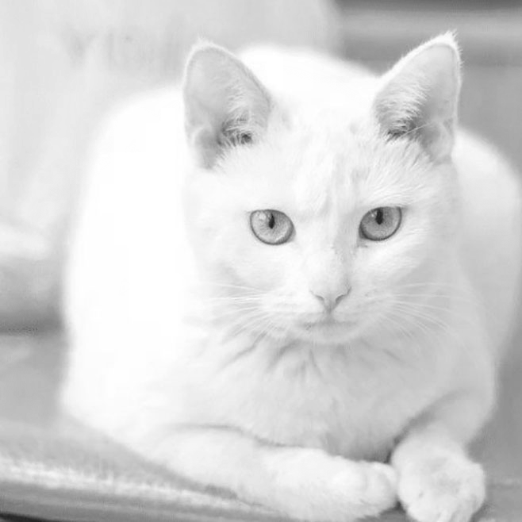
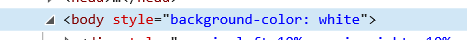
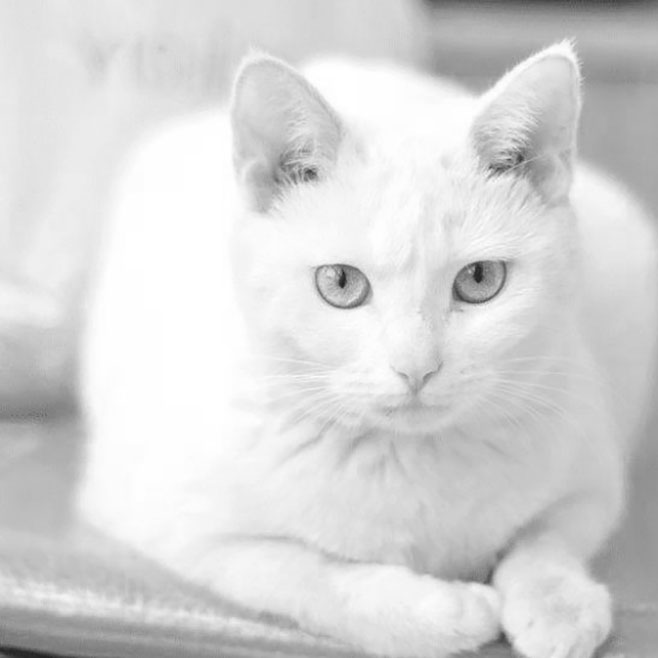
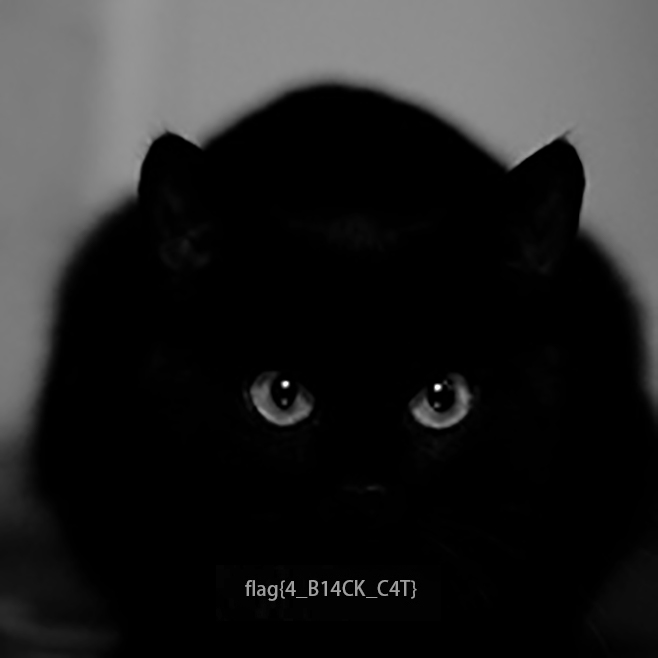

# 白与夜

这里是~~全场除签到题外最水的题的~~ writeup

~~先吸一口猫~~

## 解题方法

方法很多，你可以：

1. F12然后发现

这里的 `white` 也是提示之一，只要改成 `black` 即可显现出flag。这样的操作对于通过了签到题的玩家应该没什么难度。
1. 下载图片并在黑色背景下查看。

## 图片生成

那么这张兼具黑白猫的图片是怎么生成的呢？

显而易见，在白色背景下看到的是白猫图，在黑色背景下看到的是黑猫图。能够产生这样的效果是因为在png文件中，每个像素都有Alpha通道值，在0~1之间（0为完全透明，1为不透明）。

设A为Alpha值，X为图片像素点的灰度（0~1），则

白底时显示的灰度为：X1 = A · X + (1 - A ) · 0

黑底时显示的灰度为：X2 = A · X + (1 - A ) · 1

那么确定了 X1 和 X2 之后，可以解出png图片的A和X：

A = 1 + X1 - X2

X = X1 / (1 + X1 - X2)

其中若 1 + X1 - X2 = 0，也就是说 X1 = 0，X2 = 1，即白底显示白色，黑底显示黑色，此时 X 可取任意值，A 取 0。

为了让 A 取值在 0~1 之间，X1 需要小于 X2，这对选取的两张图片的灰度有要求，白底图应始终比黑底图亮。

刚刚讨论的是灰度图，但是很可惜RGB图片不能这样处理，因为RGB三个通道都可以这样算出一组A和X。其中A不能保证相同，但A最终的取值只能有一个。

于是我准备了一张白猫图和一张黑猫图，其中黑猫图带有flag。用photoshop将它们处理成**相同大小**的灰度图，然后运行 `run.py` 脚本生成新图。

~~做题不会使你快乐，但是吸猫会（逃~~
