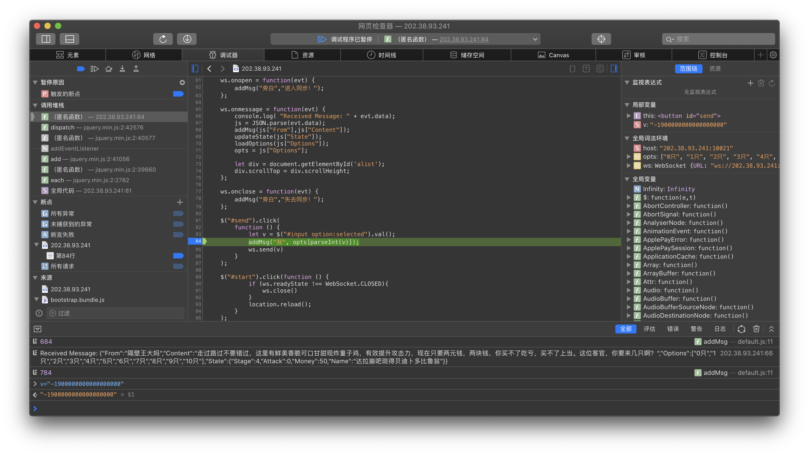
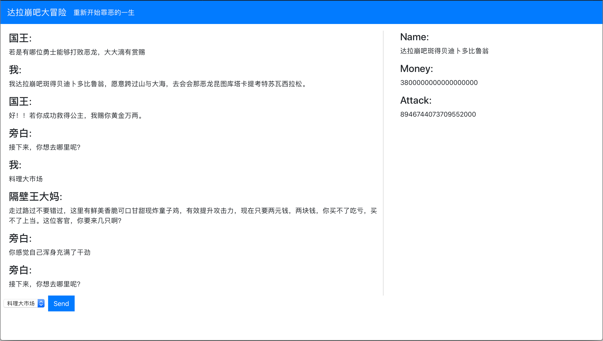
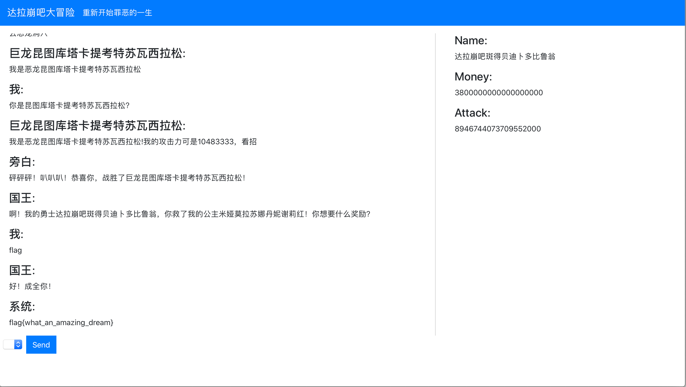
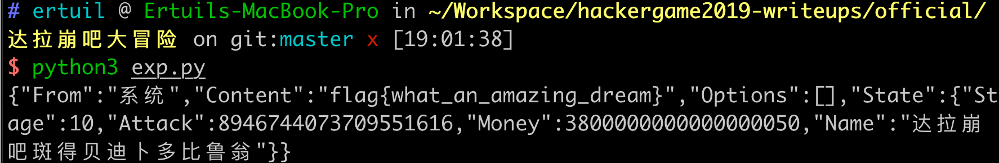

# 达拉崩吧大冒险

这道题的灵感来源是曾经血洗 Bilibili 的原创歌曲《达拉崩吧》。由 ilem 填词，洛天依和言和原唱。[原版视频](https://www.bilibili.com/video/av9372087/)。如果你是达拉崩吧，你会如何打败恶龙呢？

## 一个简单的整数溢出漏洞

观察到 WebSocket 的 JavaScript 代码中，向服务器通信的代码如下：

```javascript
    $("#send").click(
        function () {
            let v = $("#input option:selected").val();
            addMsg("我", opts[parseInt(v)]);
            ws.send(v)
        }
    );
```

直接将选择框的选项编号直接发送，可能会存在注入的可能。

在“料理大市场”买鸡的时候，当 `v = -1900000000000000000` 时候，则会发生大整数溢出，并使得自己的攻击力溢出，而后挑战恶龙即可。

最简单的做法是使用 Chrome 调试的功能，就可以完成拿到 flag 。首先在途中位置打断点。将 v 的值改为 -1900000000000000000。即可获得 flag。







## 使用 Python 的 websocket 库来做题

也可以使用 exp.py 来获得 flag。



## 其他解法 —— 无限猴子定理

本题理论上存在无限猴子定理，总有非零的概率，通过打小怪的方式升级到足够的攻击去挑战恶龙！

## 关于题目

本题蹭了一个老梗，对此出题人目前非常害怕。希望《达拉崩吧》这首歌给大家带来欢乐！
哔哩哔哩 (゜-゜)つロ 干杯 ！

